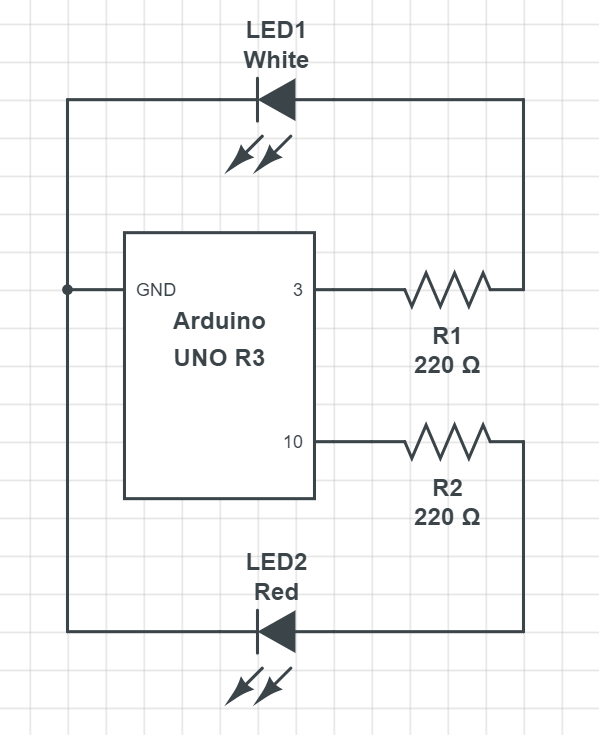

# Arduino_3.25-Controlling_Digital_Output_II
Let's see what we remember from our first coding assignment.  This is a repeat with a slight variation.  This time there is no starter code.

### Step One: Build the Prototype

To begin, build this prototype on your breadboard:

After you have completed the prototype you can test your circuits using the 5V pin to make sure they work.

### Step Two: Write the Code

Write a sketch in the Arduino Web Editor that does the following:
- LED2 blink on for 500 ms
- LED2 blink off for 500 ms
  - Repeat this cycle once
- Pause 1 second
- LED1 blink on for 250 ms
- LED1 blink off of 1000 ms
  - Repeat this cycle twice
- Pause 2 seconds
- Both lights blink on at the same time for 500 ms
- Both lights blink off at the same time for 200 ms
  - Repeat this cycle forever

See the video here for guidance.

### Step Three: Debug and Submit

Make sure your prototype behaves the same way as the one in the video.  As in the previous assignment, make a new file here on GitHub.  Name it **3.25_Controlling_Digital_Output_II** and Commit it to the repository.

**REMEMBER: THIS ASSIGNMENT REQUIRES BOTH A VIDEO OF YOUR PROTOTYPE AND CODE SUBMITTED ON GITHUB**
